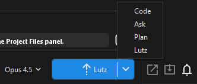
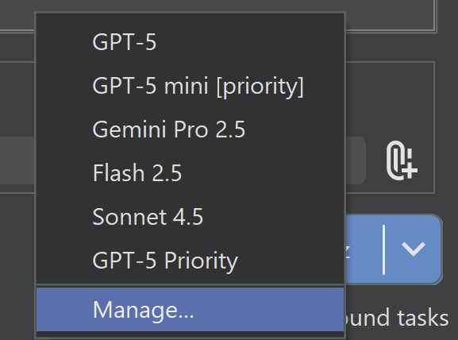
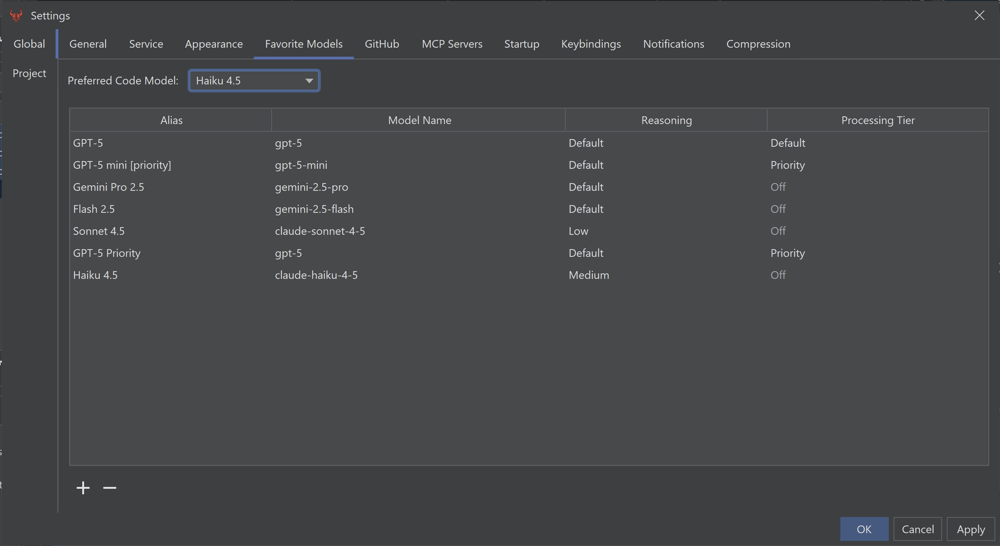

Besides Lutz Mode (described in Quick Start), Brokk supports a lower level of manual control. You can click on the arrow in the Lutz button to select a different action, or use the hotkey (Ctrl/Cmd + M) to toggle between them:

The following actions are available: Code, Ask, Plan, and Lutz. With the exception of Lutz, all actions are only available in Advanced mode.

## Code

Like Ask, Code operates _on your current Context._ The difference is that Ask will never make changes, and Code will try to make changes to solve your Instructions if at all possible.

## Ask

Ask allows you to ask questions _about the current Context_. No additional search is performed; this makes it significantly faster if you already have appropriate Context available.

## Plan

Plan allows you to send a prompt in to the LLM to generate a plan for your project. Plan mode becomes available when you have switch to advanced mode in the settings UI. Plan mode always creates a task list instead of leaving it up to the LLM to decide, but does not automatically start executing tasks.

## Lutz

Lutz is the default mode. A full description is available in the [Quick Start](/documentation/quick-start). As of .18 Lutz Mode was updated to  implement simple tasks directly instead of creating a Task List first.

## Configuring Models

Select Manage in the model dropdown next to the Lutz button to configure your models. (This is also available in the global Settings dialog.)

The models you add to this dialog will appear in the Instructions panel for use with the selected settings.

This is also where you can set your preferred code model. This is used in Lutz Mode for the coding sub-tasks, while the model from the Instructions dropdown is used for planning. This allows you to use a faster/cheaper model like Haiku for coding, while keeping important planning running on a smarter/more expensive model.

The Brokk [Power Ranking](https://brokk.ai/power-ranking?ref=blog.brokk.ai) can shed some light on which models you should consider using.

Next: [Reviewing Your Work](/documentation/reviewing-your-work)
