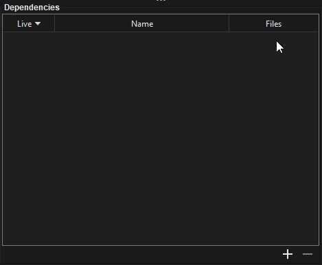
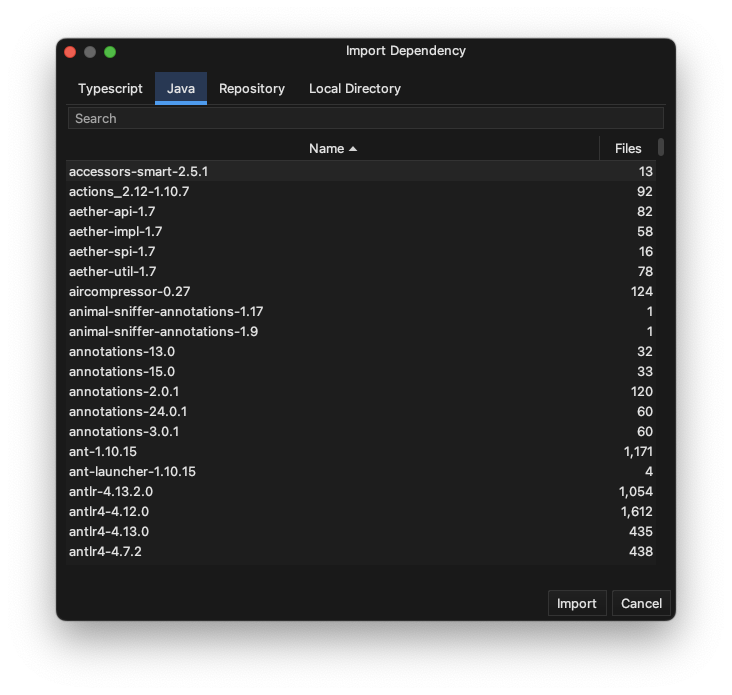

## Working with Dependencies

Often, you'll work with dependencies that are poorly documented or for which your LLM lacks sufficient version-specific knowledge, leading to API hallucinations. Brokk addresses this by allowing you to pull these dependencies into your project, where they can be manipulated like any other source file.

💡

Navigate to the Dependencies panel and select the ****+**** button

💡

Once in the dependencies menu select the Import button to add your desired dependencies

Dependencies Menu

Brokk will decompile the JAR. You'll see a message like "Decompilation completed. Reopen project to incorporate the new source files."

Once reopened, the decompiled source code from the dependency is available to Brokk. You can interact with these decompiled files much like your own project source:

-   They can be read, searched, and their symbols can be used for operations like "Symbol Usage" or "Call graph."
-   They can be summarized. To get an overview of an entire imported library, you can use the Summarize action (from the Workspace menu or Ctrl+M), and in the Summarize Sources dialog, enter the path to the decompiled dependency JAR followed by the recursive glob pattern \*\* (e.g., .brokk/dependencies/langchain4j-core-1.0.3.jar/\*\*.java) to summarize all classes within it. You don’t need to memorize this path; just give the name of a class in the library and hit ctrl-space to autocomplete it.  This is how I summarized the langchain4j-core library in the first Workspace screenshot.
-   These decompiled files are treated as read-only; you cannot edit them directly.

The key benefit is that the LLM (and Brokk's code intelligence features) gain access to the precise API and structure of the _exact version_ of the library you are using. The decompiled source is highly effective for LLM comprehension—often 99% as useful as the original source would be—and this drastically reduces the chances of the AI hallucinating non-existent or incorrectly used APIs from the dependency. That said, automating the download of sources jars to avoid decompilation is on the roadmap as well.

Next: [MCP Client Support](/documentation/mcp-client-support)