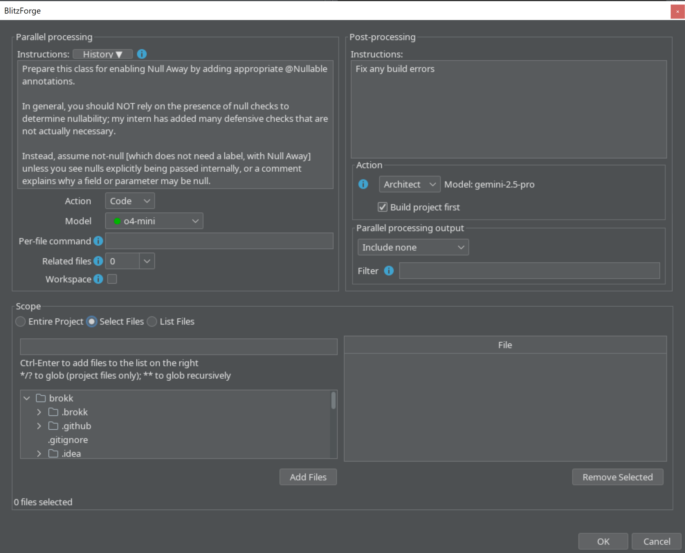

BlitzForge is a feature that makes large-scale changes faster, safer, and easier to manage. Whether you're refactoring outdated patterns, applying structural changes, or upgrading dependencies, BlitzForge can parallelize your instructions across hundreds of files at once.

You can access BlitzForge in the Tools menu (Tools → BlitzForge). Here's what the different sections do.

Parallel processing is the core of BlitzForge:

- **Instructions**: Specify the prompt to apply to each file.
- **Action**: Code or Ask. As with [the normal Brokk actions](/documentation/actions-toolkit), Ask will answer questions without making changes, while Code will edit your files.
- **Model**: the model to perform the parallel edits with. Models are color-coded by the parallel throughput you can expect.
- **Per-file command**: Optionally attach the output from this command to each request to send to include in the LLM's context; for example, `git show commit-ish –- {{filename}}` will pull out the changes from `commit-ish` that affected the given file.
- **Related files**: Optionally include the Code Intelligence summaries of the most closely related files for each target file.
- **Workspace**: Optionally attach your current workspace context to each request.
- **Scope**: Specify which files should be targeted by the prompt. You can choose the entire project, manually add files from the file tree, or give a list of files, where Brokk will automatically extract file names from a large block of text.
- **Post-Processing**: once the parallel processing finishes, you can optionally kick off a postprocessing task that can see the entire body of changes and adjust as necessary. Here's what these options do:
- **Action**: select the Architect, Brokk's tool-using agent that can autonomously update the Workspace and invoke Code Agent to make changes, or Ask, a simpler single-round tool for questions or summarization. The default model from your Settings will be used for the post-processing action.
- **Build project first**: when enabled, runs the build and provides its output to the Action agent.
- **Parallel processing output**: select from None, All, or Changed Files Only.
- **Filter**: an optional natural-language classification directive to further narrow down the output provided.

Next: [Advanced Topics](/documentation/advanced-topics)
