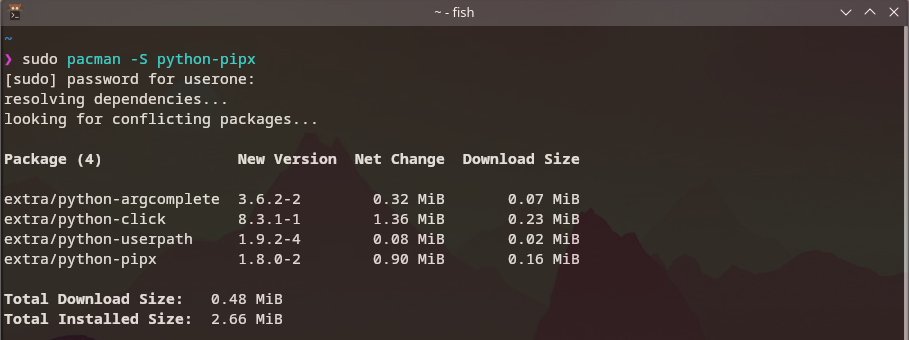
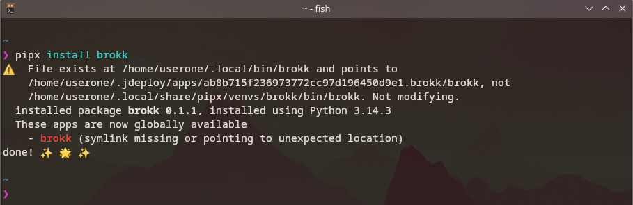
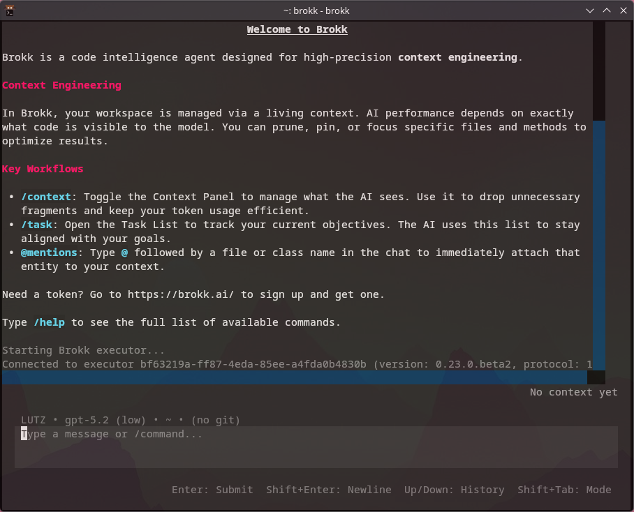

# Getting Started with the Brokk CLI

The Brokk CLI (Command Line Interface) is a lightweight way to use Brokk directly from your terminal.

## Prerequisites

- Python 3.10+
- Git
- GitHub Account (not required for CLI but recommended for the full experience)



## Installation

The most reliable way to install the Brokk CLI is using `pipx`, which manages a dedicated environment for the tool automatically.

### 1. Install pipx (if you don't have it)

*Wait! Before running the following commands, it is generally recommended to ensure your package manager's index is up to date (e.g., `sudo apt update`, `sudo dnf upgrade`, `brew update`, or `sudo pacman -Syu`).*

- **macOS**:

  ```bash
  brew install pipx
  ```

- **Linux and WSL**:
  - **Debian/Ubuntu**: `sudo apt install pipx`
  - **Fedora**: `sudo dnf install pipx`
  - **Arch**: `sudo pacman -S python-pipx`
- **Windows**:
  - **Scoop**: `scoop install pipx`
  - **Winget**: `winget install Python.Python.3.11 && pip install --user pipx`
  - **Pip**: `pip install --user pipx`

*Note: After installing pipx for the first time, run `pipx ensurepath` and restart your terminal.*

### 2. Install Brokk

Run the following command in your terminal:

```bash
pipx install brokk
```



### 3. Verify Installation

Simply type:

```bash
brokk
```



Next: [Code Intelligence](/documentation/code-intelligence)

