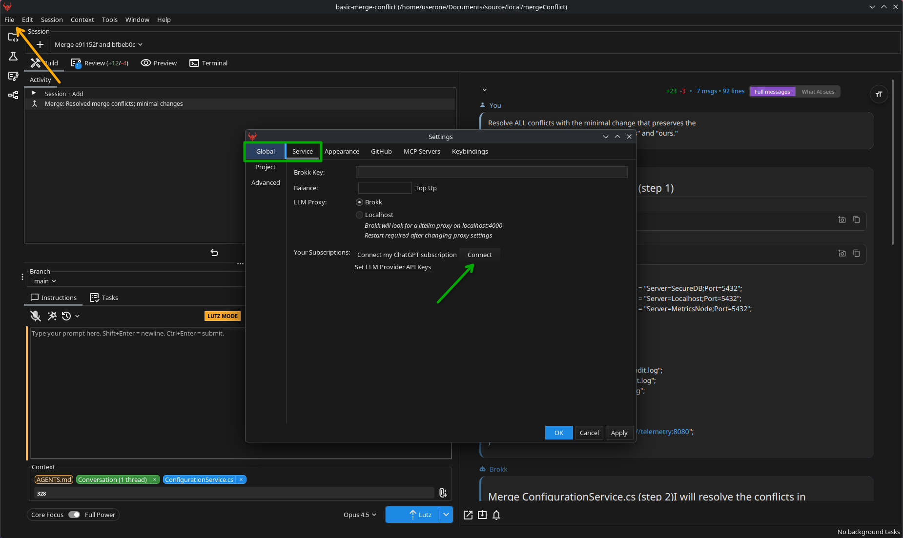
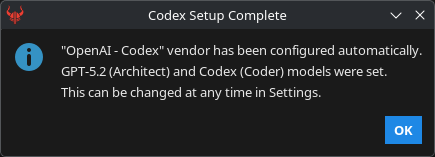
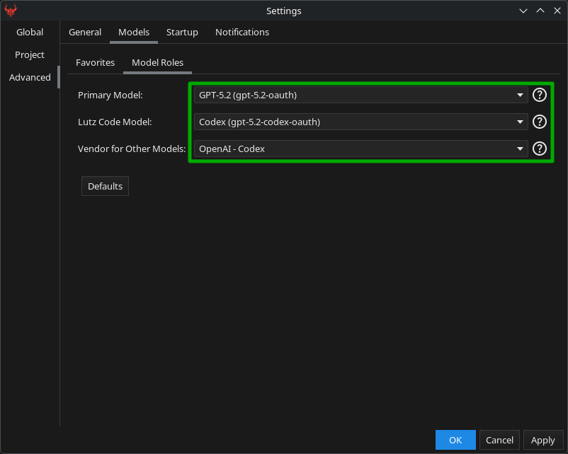
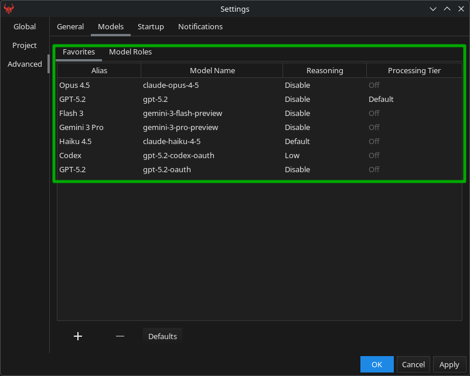
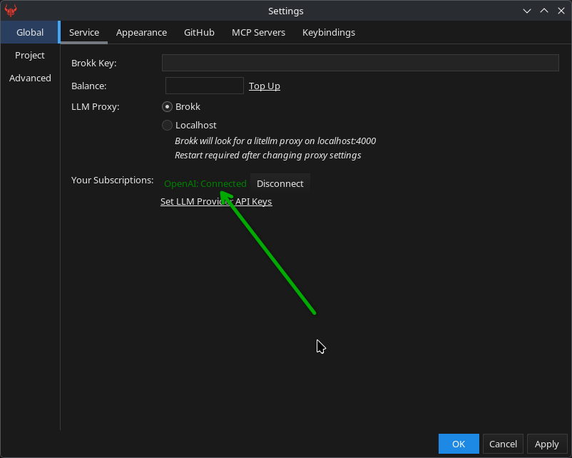

# ChatGPT Subscription Integration

Brokk can use your existing ChatGPT (OpenAI) subscription to power context-aware reasoning directly in your workspace. Configuration is quick: Open Brokk, navigate to settings and follow the instructions below.

## Requirements

- An active OpenAI account (any level of subscription will work).
- A valid Brokk account API Key and desktop installation.

## Configure your ChatGPT subscription in Brokk

1. Log in to ChatGPT in your primary browser.
2. Open Brokk and go to **Settings → Global → Service**.
3. In **Your Subscriptions**, find **Connect my ChatGPT subscription** and click **Connect**.

   .

4. If logged in, Brokk will detect your active ChatGPT session and prompt you to select it.

   .

5. Brokk will automatically set your preferred models for both Primary and Code. See the note below.

   .
   .

> ⚠️ **Warning:** Connecting your ChatGPT subscription will reset Brokk favorites to defaults and set your Primary and Code providers to GPT models.

## Verify and use

1. Confirm the connection in **Settings → Global → Service**; the ChatGPT entry shows as connected.

   .

2. Start a Brokk session; the configured ChatGPT provider will handle reasoning with your repository’s mapped context.
3. You can switch providers per session if multiple LLMs are configured.
4. Happy coding with Brokk and ChatGPT!

Next: [Code Intelligence](/documentation/code-intelligence)