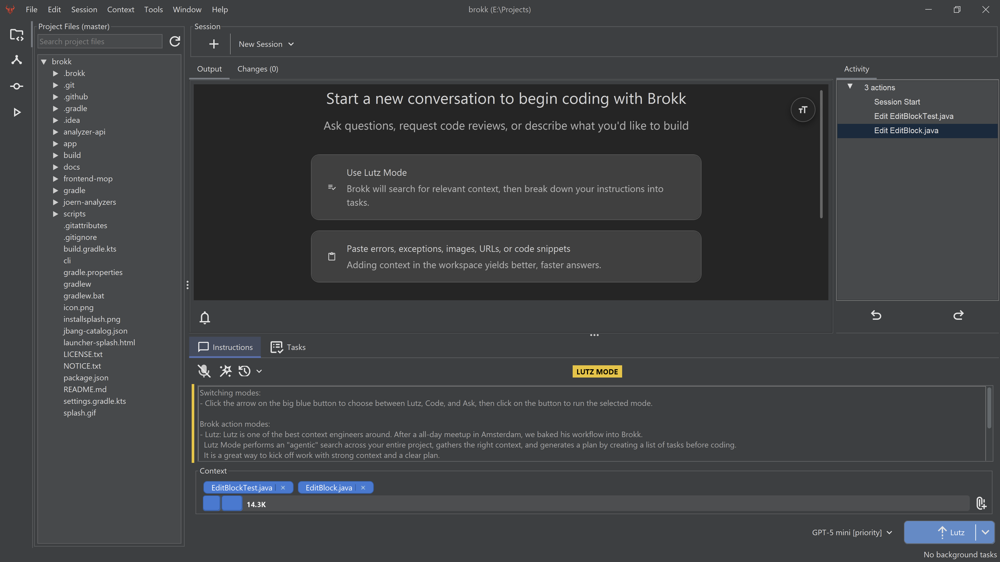
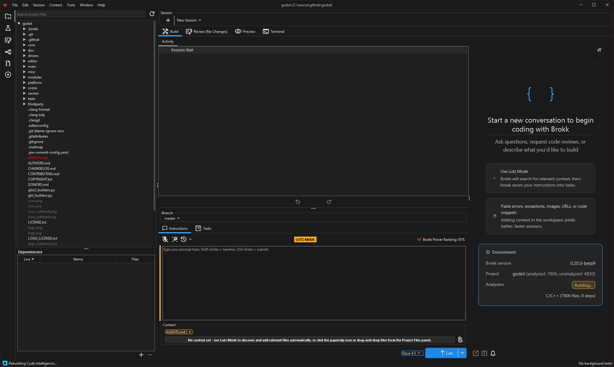
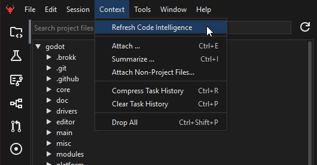
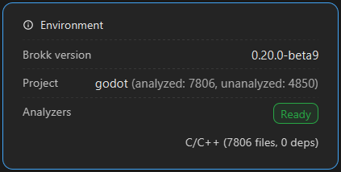
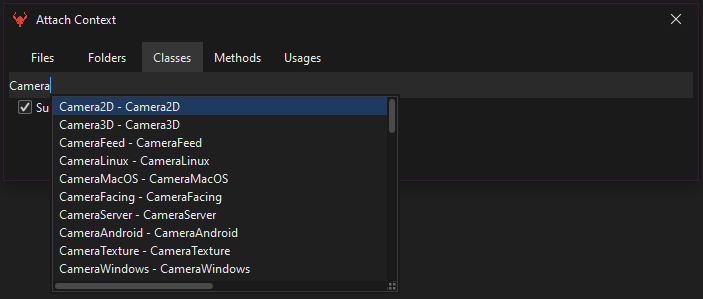

**Brokk** (the [Norse god of the forge](https://en.wikipedia.org/wiki/Brokkr?ref=blog.brokk.ai)) is the first code assistant that understands code semantically, not just as chunks of text. Brokk is designed to allow LLMs to work effectively on large codebases that cannot be jammed entirely into working context.

To accomplish this, the Brokk team has broken free of the past forty years of IDE design to rethink how a human engineer can most effectively supervise an AI assistant. With Brokk, your job is not to read and write code a line at a time but to supply the LLM with the appropriate knowledge of the codebase so that it can handle the tactical details of code production.

## How it Works

Unlike other AI tools that treat your source code as plain text, Brokk performs compiler‑grade static analysis to give large‑language‑models (LLMs) **semantic awareness** of classes, methods, call‑graphs, and stacktraces. Brokk mixes that with the ability to understand Git history and even decompiled dependencies to provide more intelligent answers, fewer hallucinations, and higher‑quality edits on very large projects.

The Brokk Interface

## Code Intelligence

Brokk’s **Code Intelligence** engine performs deep static analysis to build a semantic model of your entire codebase. It understands files, folders, classes, methods, and more not just as text, but as a structured program. This allows Brokk to answer complex questions about your code, trace logic across files, and provide context that would be impossible to fit into a standard LLM prompt.

Brokk builds code intelligence when you first open a workspace, and keeps it up to date as you make changes. 

## Code Intelligence in Action

You can also manually trigger a rebuild of the code intelligence index.

Once the analysis is complete the interface will show "ready" and you will be able to ask questions about your codebase.

You are able to navigate to the summarize option via the context menu to refine your context at various levels of granularity. You can summarize files, folders, classes, methods, and more.

Brokk’s **Code Intelligence** is the foundation of it's ability to provide intelligent answers, fewer hallucinations, and higher-quality edits on very large projects.

Next: [Quick Start](/documentation/quick-start)
