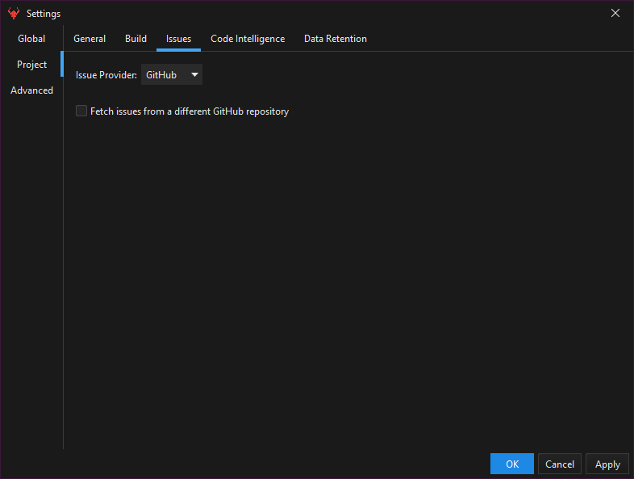
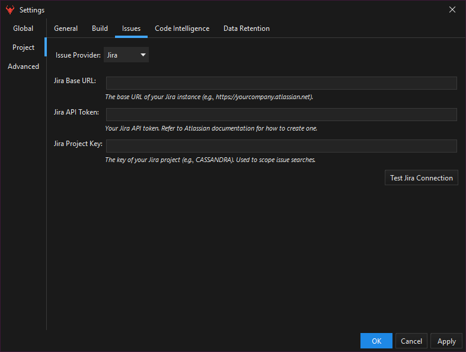
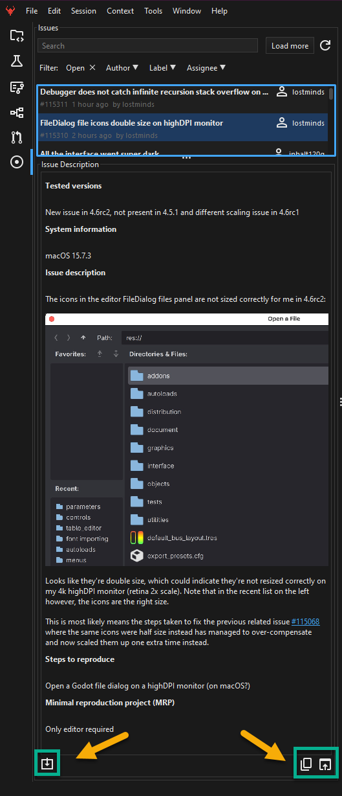

Brokk AI embeds the project’s issue tracker directly inside the application so you can triage, review, and capture work items without leaving your coding flow. You’ll find the **Issues** tab in the left side bar.

## Accessing the Tracker

Open the **Issues** tab in the left side bar. The list will populate with issues for the current Git repository or for any override you’ve configured in project settings.

## Default & Custom Connections

By default, Brokk pulls from **GitHub Issues** of the current repository. To override:

1.  Go to **File → Settings → Project → Issues**
2.  Choose a different source:
    -   **GitHub Override**: Fetch issues from another GitHub repo by ticking _“Fetch issues from a different GitHub repository”_, then enter **Owner**, **Repository**, and (optional) **Host** for Enterprise setups.
    -   **Jira Connection**: Switch the provider to _Jira_, supply your **Base URL**, **API Token**, and **Project Key**, then test and apply.  
        

## Working with the Issue List

-   **Refresh** - Click **Refresh** to pull in new issues, status updates, and comments.
    
-   **Search** - Type in the **Search** field for live filtering.
    
-   **Filters** - Toggle column filters to narrow by **Status**, **Author**, **Label**, or **Assignee**.
    

## Issue Details & Actions

-   **Copy Description** - Use the context menu or bottom button to copy the issue text as plain text.
    
-   **Open in Browser** - Opens the selected issue in your default web browser for deeper review.
    
-   **Capture** - Captures the issue with all comments and images as structured fragments in your Brokk AI workspace. These fragments become searchable context you can reference in prompts, summaries, or code generation.
    

Next: [Sessions and History](/documentation/sessions-and-history)