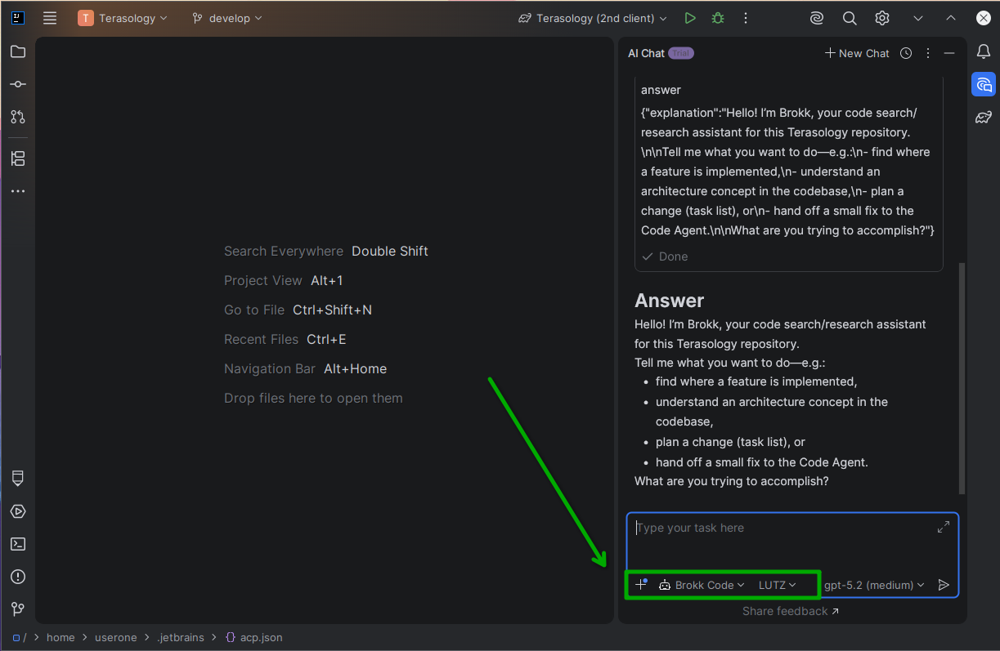

# JetBrains IntelliJ Integration

Brokk has added a seamless integration with JetBrains IntelliJ IDE**, allowing you to run your Brokk agents directly from the IDE. This integration enables developers to leverage the power of Brokk's agents while working on their code, providing a more efficient and streamlined workflow.

**Note: While testing was done with IntelliJ, the Brokk Code assistant is an ACP integration and should work with any JetBrains IDE that supports ACP.

## Requirements

- IntelliJ Installed CE with a free subscription to access the IntelliJ AI assistant plugin.
- Brokk TUI installed and configured with API key.


## Configure Brokk in JetBrains

This can be done by Installing Brokk TUI and running the following command in the terminal:

```bash
brokk install intellij
```

- Note: if this file already exists you may need to run --force to overwrite the existing file.

If you have existing configurations for IntelliJ you can add the lines below to simply add the Brokk configuration to your existing file.

Edit the file below:

```
$HOME/.jetbrains/acp.json
```

```bash
# Brokk Configuration
{
  "default_mcp_settings": {},
  "agent_servers": {
    "Brokk Code": {
      "command": "brokk",
      "args": [
        "acp"
      ],
      "env": {}
    }
  }
}
```

## Verify and use

Once installed properly you will see the Brokk selection along with the agent selection in the intelliJ AI assistant. You can select Brokk and use it to run your agents directly from the IDE



Next: [Code Intelligence](/documentation/code-intelligence)
