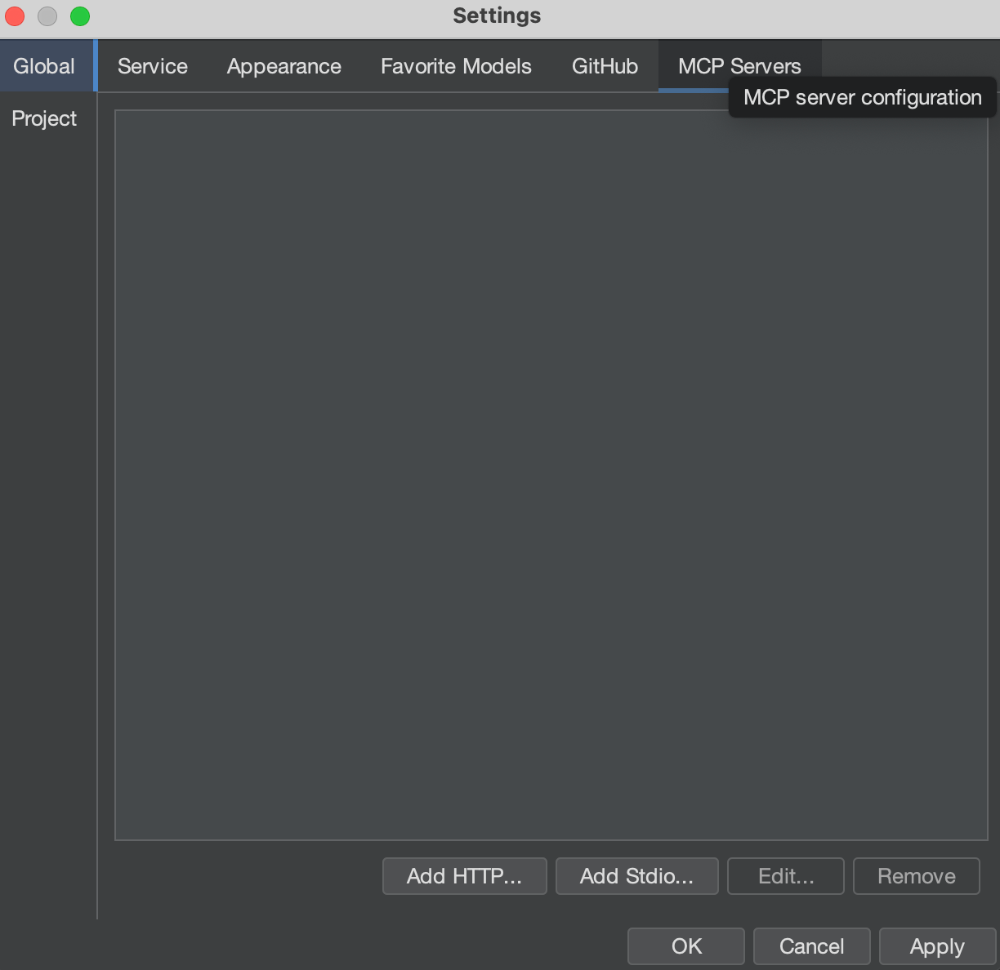
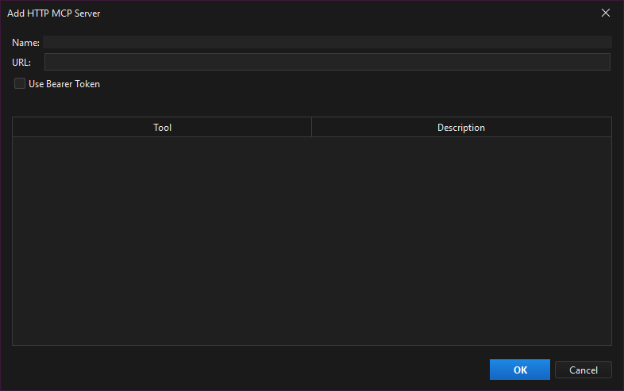

## Using MCP Servers in Brokk

Brokk now supports **MCP (Model Context Protocol) servers**, giving you more flexibility in connecting external tools, services, and workflows directly into your AI coding assistant.

With MCP integration, you can connect to both **HTTP-based MCP servers** and **Stdio-based MCP servers** depending on your setup.

___

## Accessing MCP Settings

1.  Open **Brokk**.
2.  Navigate to:  
    **File → Settings → Global**
3.  In the settings menu, open the **MCP Servers** tab.

Here you will see the list of currently configured MCP servers, along with controls for adding or modifying them.

___

## Adding an MCP Server

1.  In the **MCP Servers** tab, click **Add HTTP or Add Stdio**.
    -   **HTTP** → For remote/network-accessible MCP servers.
    -   **Stdio** → For local MCP servers that communicate over standard input/output.
2.  Enter the connection details required for your MCP server type.
3.  Save your changes.

Your new MCP server will now appear in the list and be available to Brokk.

___

## Example Use Cases

-   **HTTP MCP**: Connect to a remote service exposing additional code intelligence or workflow integrations.
-   **Stdio MCP**: Run a local toolchain or custom service that Brokk can interact with as if it were part of the application.

Next: [FAQ](/documentation/faq)