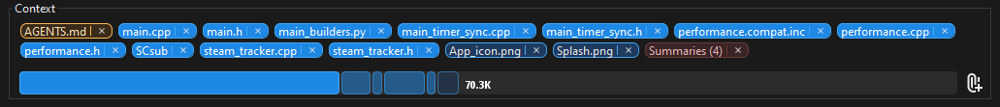
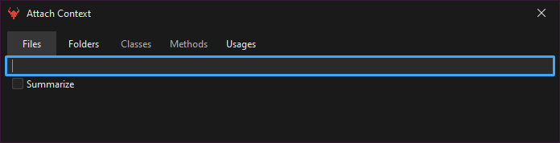
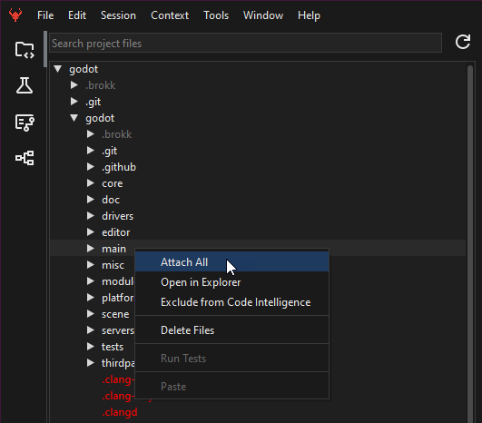
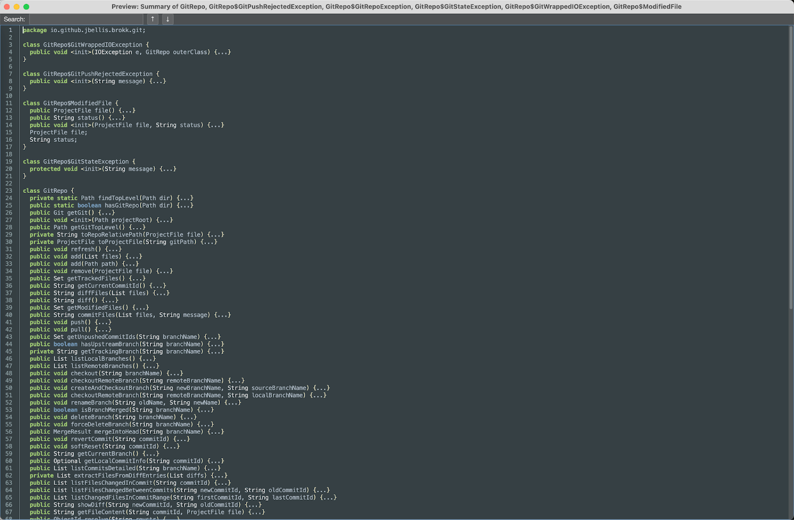
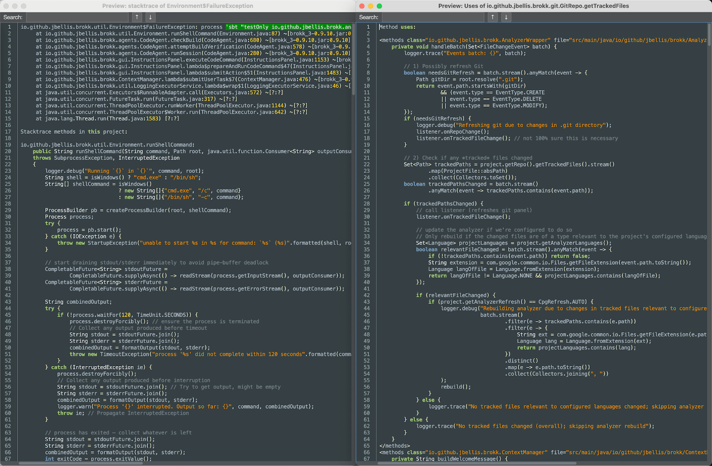

## Why Context Matters

LLMs fail on large projects not because they’re not smart enough to solve your problem, but because they can’t see enough relevant code at once and/or they don't know where to find the right pieces. (Almost as bad is [having too much _irrelevant_ code](https://www.dbreunig.com/2025/06/22/how-contexts-fail-and-how-to-fix-them.html?ref=blog.brokk.ai) in the conversation.) Most AI coding tools allow you to explicitly specify context, but without letting you easily see what else the tool is automatically injecting.

Brokk addresses this by making everything in the Context is visible and editable.

## Controlling your Context

Brokk's Lutz Mode will automatically add to the context while researching your problem. If Brokk misses important information, you can add it with the Attach button:

Which opens the following dialog; type what you are looking for to autocomplete:

This has a keyboard shortcut (Ctrl/Cmd + E), and "Summarizing" (see below) is important enough that it gets its own hotkey too (Ctrl/Cmd + I).

You can also attach context by dragging and dropping files or folders from the Project tree, or by right-clicking:

Brokk can add many types of context to the Workspace, some of these are:

1. An image file added from local disk
2. An ordinary source file
3. Summaries of all the classes in a dependency library
4. A pasted image
5. A pasted stacktrace
6. A diff of a Git commit
7. A page of dependency documentation pasted via URL.
8. Usages of a specific method
9. An ordinary, editable source file

You can click on any of the context badges to open a preview of its contents; you can also right-click on a badge to interact with it. This is particularly useful for pulling files affected by a Git commit into the Workspace. Added in the .18 and .19 releases respectively is the ability to both mark fragment read only and Pin them. When a fragment is marked Read Only it informs the LLM that a correct solution should not change those files or code fragments. When a fragment is pinned it is always included in the context, even if it is not relevant to the current task. Enabling Advanced UI in the Settings is required to access these features.

## Summarization

The main tool that Brokk uses to slim down the Context is summarization. Here is what a Brokk summary of a source file looks like:

Brokk extracts the signatures and declarations to show the LLM how to use this class without hallucinating. Brokk also includes private fields and methods to give a hint of how the implementation works under the hood. This means that you almost never need to include full source files in the Workspace unless they are going to be actively edited.

Lutz Mode will attempt to automatically use Summarization, but if you see it struggling with very large Context, being able to step in and override its choices (right click -> Summarize) can be useful.

## Advanced Context

This shows stacktrace and "usages" context fragments side by side:

For the stacktrace, Brokk includes the full source of any method in your project.  For the usages, it similarly shows not just the call site but the source of each calling method.  This lets Brokk perform refactoring across your codebase without having to load entire files into the Workspace.  Smaller contexts mean faster and cheaper calls to the LLM.

Next: [The Edit Loop](/documentation/the-edit-loop)
