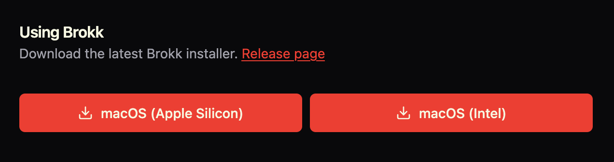
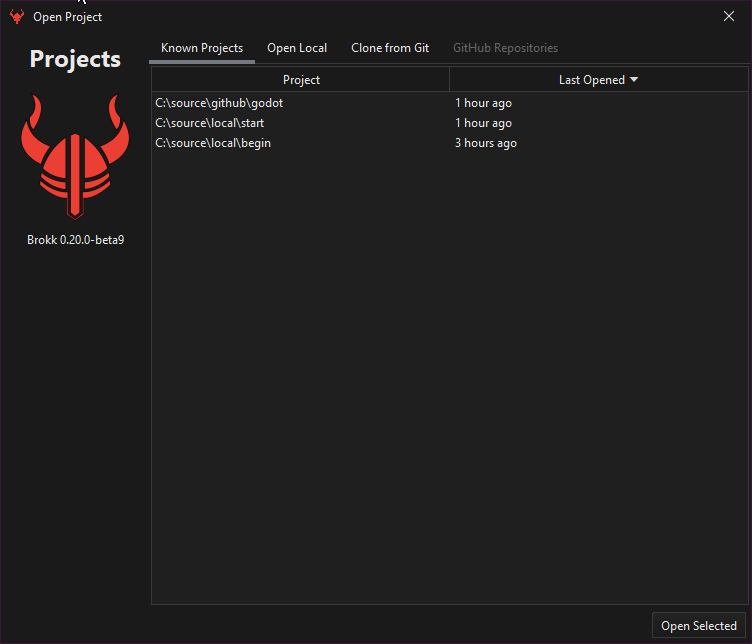
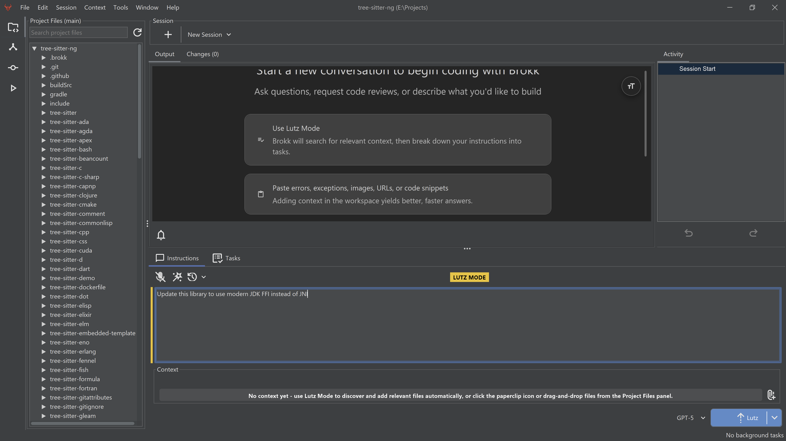
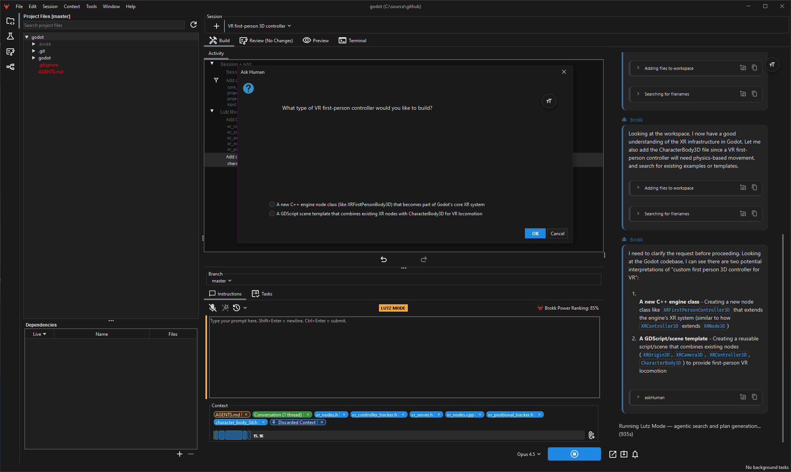
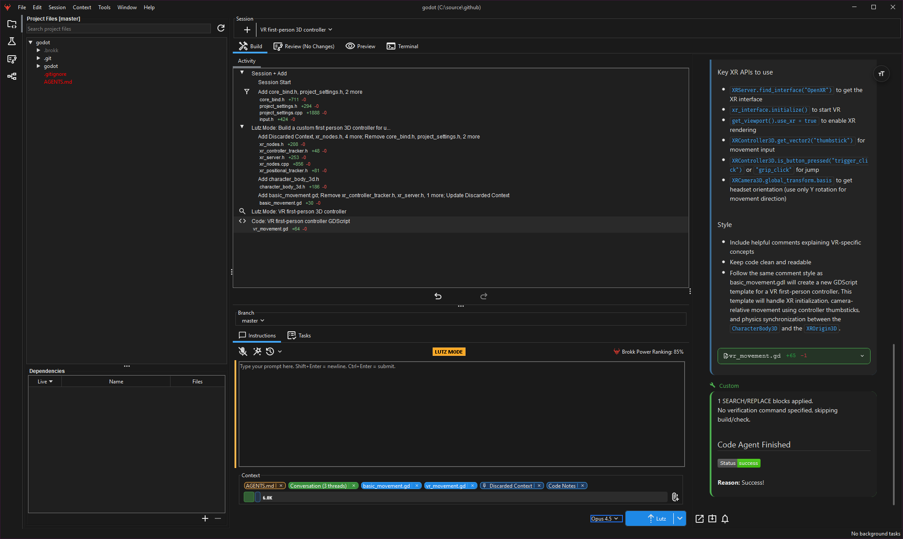

**First, sign up** for an account on [brokk.ai](https://brokk.ai/signup?ref=blog.brokk.ai).

**Next,** [**download and run the installer**](https://brokk.ai/dashboard?ref=blog.brokk.ai). Linux, Windows and Mac Operating Systems are supported.

**In the installer you will see a "Prereleases" option which means beta releases will be included in automatic updates. We recommend leaving it off unless a developer advises you to enable it to try out a feature or bug fix.**

The first launch opens the Project Chooser.

Pick the directory containing your source code, preferably with Git enabled, and Brokk will open it up.

## Hello, Brokk

By default, Brokk operates in _Lutz Mode_. Named after Brokk's top context engineer, Lutz Mode automates a research + plan + build pattern that keeps LLMs on-task. To start, describe your problem in the Instructions:

When you click on the blue Lutz button in the lower right, Brokk will start researching how to solve your problem. You can follow its progress in the Output. As it searches, Brokk will attach files, summaries, and other code fragments to its Context:

When it completes its research, Brokk will break down your problem into a series of tasks. You can edit, split, modify, reorder, or remove tasks from the task list at this point. When you're satisfied with the plan, click on the blue button again to execute it!

Next: [Managing Context](/documentation/key-concepts)
