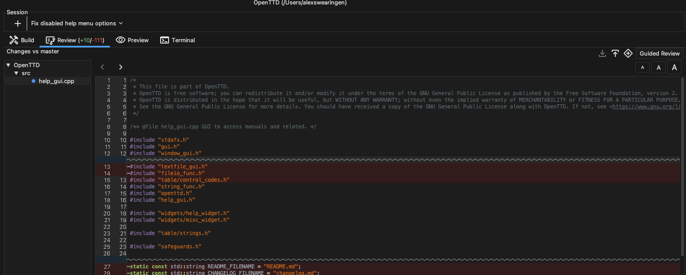
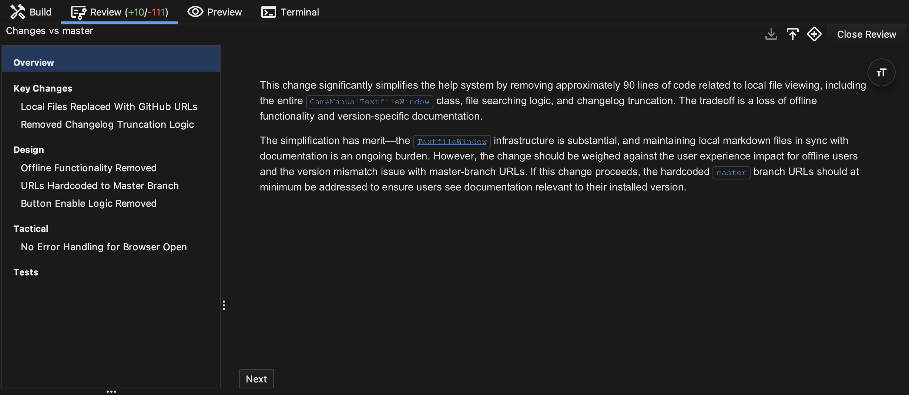
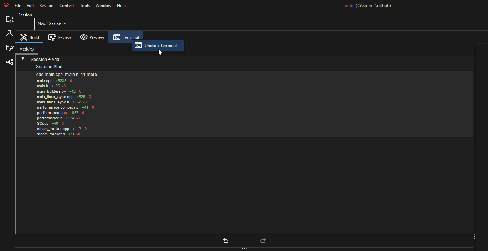

After making changes, Brokk can audit its changes with Guided Review.

To access Guided Review, select the “Review” tab at the top of your workspace, then hit the “Guided Review” button.

Guided Review Structure: Your review will be split into 5 sections

- **Overview**: Summary of changes made on the branch
- **Key Changes**: Descriptive list of changes
- **Design**: Potential high-level issues from the changes
- **Tactical**: Potential bugs & edge-cases from the changes
- **Tests**: Recommended changes to the test suite

All tabs with the exception of the the Build tab can be undocked from the main window. This includes the Review, Preview, and Terminal tabs. Once undocked they become standalone windows that can be moved and resized. These windows can be docked to the main window and any time from within each undocked window.

Next: [Using Git](/documentation/using-git)
