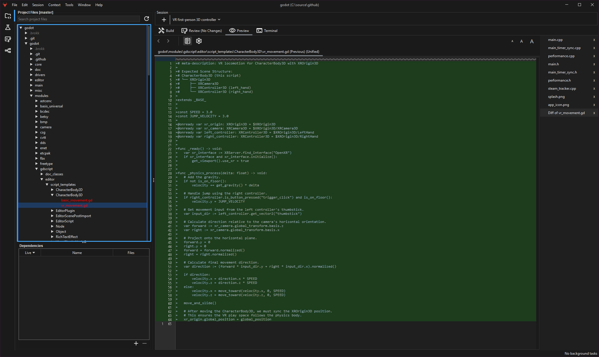
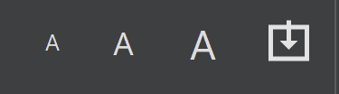

Besides looking at [diffs from individual tasks](https://blog.brokk.ai/sessions/), Brokk gives you an overview diff of all changes made in the current Session:

Of course, you can review this diff by hand, but like most Brokk previews, this includes a Capture button:

Use this to attach the diff as Context, where it will be visible to [Ask](https://blog.brokk.ai/actions-toolkit/) actions. You can also right-click on the badge to attach the full (or summarized) contents of all referenced files with a single click:

Next: [Using Git](/documentation/using-git)