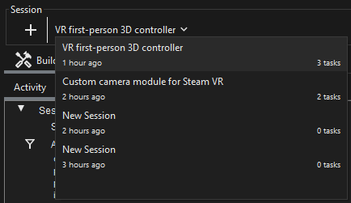
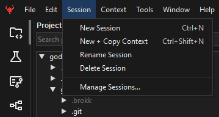
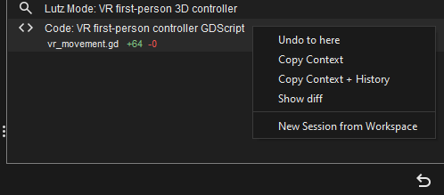
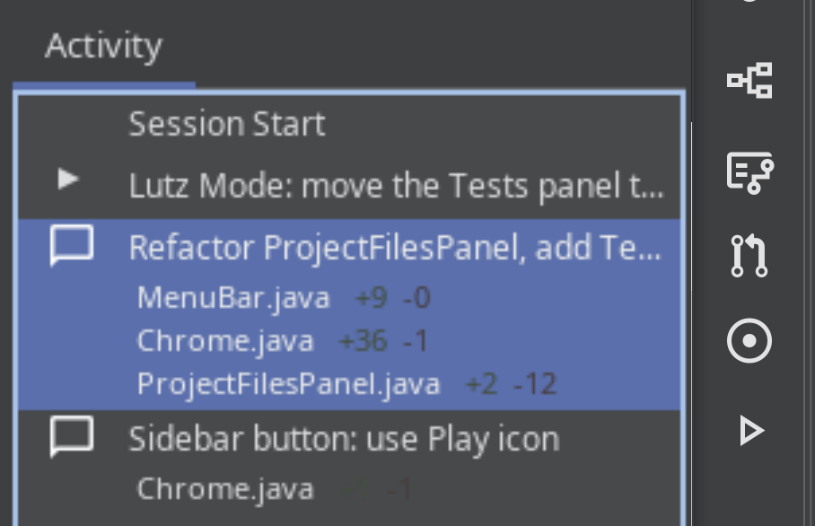

## Sessions

Brokk divides your work into **Sessions**, each of which has a linear view of actions taken. In general, we recommend using the Session as your unit of work-to-submit, e.g. in a Pull Request.

You can easily switch between or create new sessions from the dropdown at the top of the window:

More options are available from the Session menu:

## History within a Session

The Activity panel allows you to go back to any point in time of your Session, either destructively with Undo, or non-destructively (preserving history and file edits) with the right-click menu entries. There are three history-related options when you right-click on an earlier state:

1. **Undo to Here**: This action reverts both your file changes on disk and the Context selections to the state they were in at that selected point in history. Any file modifications made after that point will be undone. (But Git history is not touched.)
2. **Copy Context**: This option reverts only the Context selections to the selected point. Critically, this action does not affect any changes made to your files on disk. This is ideal for scenarios where you've completed a side quest, committed those file changes, and now want the AI to refocus on your main task as it was before the diversion, while keeping the code from your side quest intact.
3. **Copy Context with History**: Copies the Context selections contents and also the conversation history from the previous state; useful for when you need to continue building on your conversation thread from the main development line.

Both "Copy Workspace" actions are represented visually in the Sessions list by arrows from the source entry to the target.

## Diffs

When changes are made in your session, a diff summary will be shown in the Activity entry:

Selecting Show Diff from the right-click menu will open a window showing the changes made.

Next: [BlitzForge](/documentation/blitzforge)
