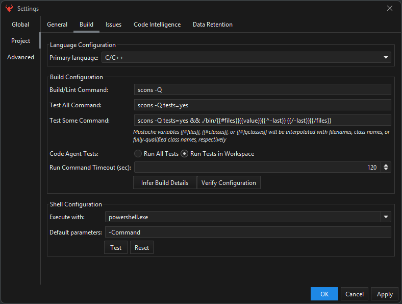

After any **Code** action, Brokk:

1.  Compiles or lints the project (Gradle, Maven, sbt, ant, ninja… or a custom shell command).
2.  Runs the tests currently in the Workspace
3.  Automatically feeds any failures back to the LLM for immediate corrections

The build commands are inferred automatically when Brokk first opens your project, and can be configured in the Settings dialog:

You can override _Run All Tests_ to point Brokk at an arbitrary CI script; any non‑zero exit status is treated as feedback for the model.

Next: [Actions Toolkit](/documentation/actions-toolkit)