## Connect Your GitHub Account

Brokk supports a wide variety of integrations with Git. To connect your GitHub account, navigate to `Settings -> Global -> GitHub -> Connect GitHub Account`.

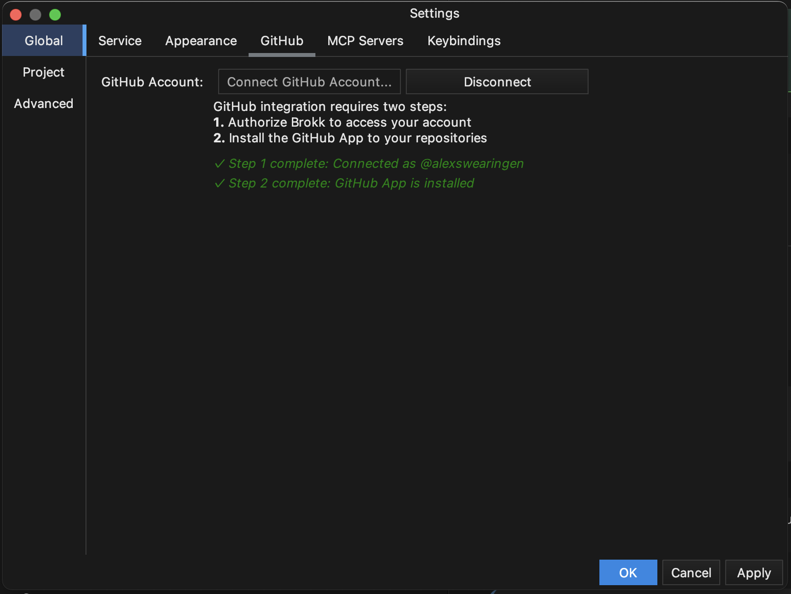

Once connected, you’ll now have 4 separate panels for managing Issues, Pull Requests, Log, and Worktrees.

## Log Sidebar

The log sidebar displays both branches and commit history for your current project.

### Branches

- **Browse Branches**: View local, remote, and tagged branches in a unified list.
  
  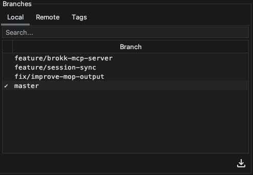

- **Interacting with Branches**: Right-click to access context-specific options.
  
  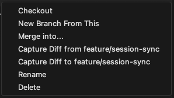

  - **Checkout**: Switch workspace to this branch.
  - **Create New Branch**: Create a new branch from this base.
  - **Merge**: Merge the branch into your current checkout.
  - **Capture Diff**: View diffs for the branch.

- **Fetch**: Manually pull in remote changes by selecting the “Fetch” option in the bottom right.

### Commits

The **Commits** panel displays the commit history of your project, similar to the output of `git log`.

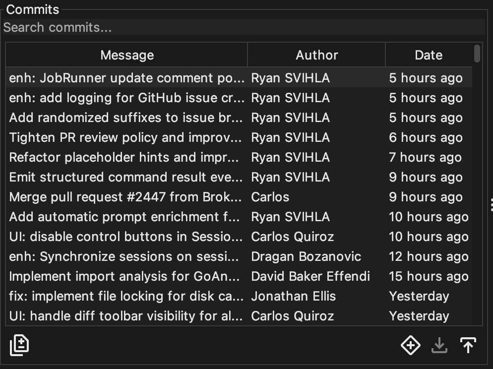

- **Interacting with Commits**: Right-clicking on a commit reveals a context menu with options to manage your history.

  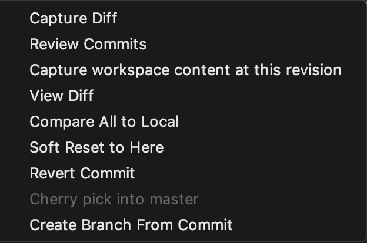

  - **Capture Diff**: Bring the changes from this commit into your context.
  - **Review Commits**: Review the selected commits with Guided Review.
  - **Capture workspace content at this revision**: Capture the entire state of the workspace at this commit.
  - **View Diff**: Open a view of the diffs in this commit.
  - **Compare All to Local**: Compare the state of the commit to your local workspace.
  - **Soft Reset to Here**: Reset your current branch to this commit, keeping changes staged.
  - **Revert Commit**: Create a new commit that reverts the changes in this commit.
  - **Cherry pick into master**: Cherry pick this commit into the master branch.
  - **Create Branch From Commit**: Start a new branch from this exact point in history.

- **Note**: Use `Shift + Right Click` to select multiple commits to review or capture to the context window.

## Git Worktree Sidebar

The git worktree sidebar lets you have the same reposity checked out **multiple times**, allowing for parallel feature work

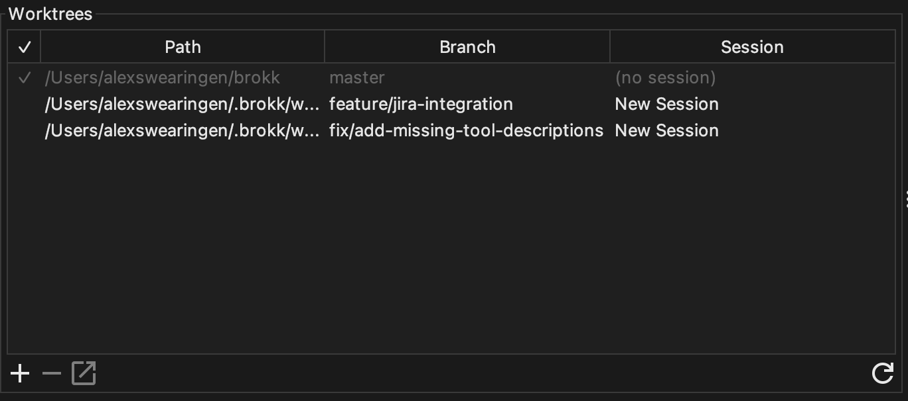

### Creating a Worktree

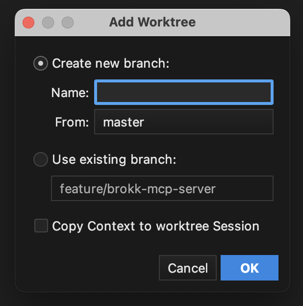

- **Create a new branch**: Choose a branch name and base branch for your worktree.
  - Alternatively, use an existing branch
- **Copy Context to Worktree Session**: Give the worktree the same active context from your current session.

Worktrees share the same `.git` object store, which makes them lighter-weight than a full clone. Additionally, Brokk projects are worktree-aware; worktrees will inherit the primary checkout's configuration.

Worktrees are not tied to a single branch; you can check out different branches from the UI in the Log tab, just like with the primary repo. However, each worktree must have a distinct branch open: because of the git index sharing, you cannot have the same branch active in multiple worktrees.

## Pull Requests Sidebar

The pull requests sidebar allows you to browse and filter PRs from your project's GitHub repository. **Note:** If the repo isn't on GitHub, this tab will not appear.

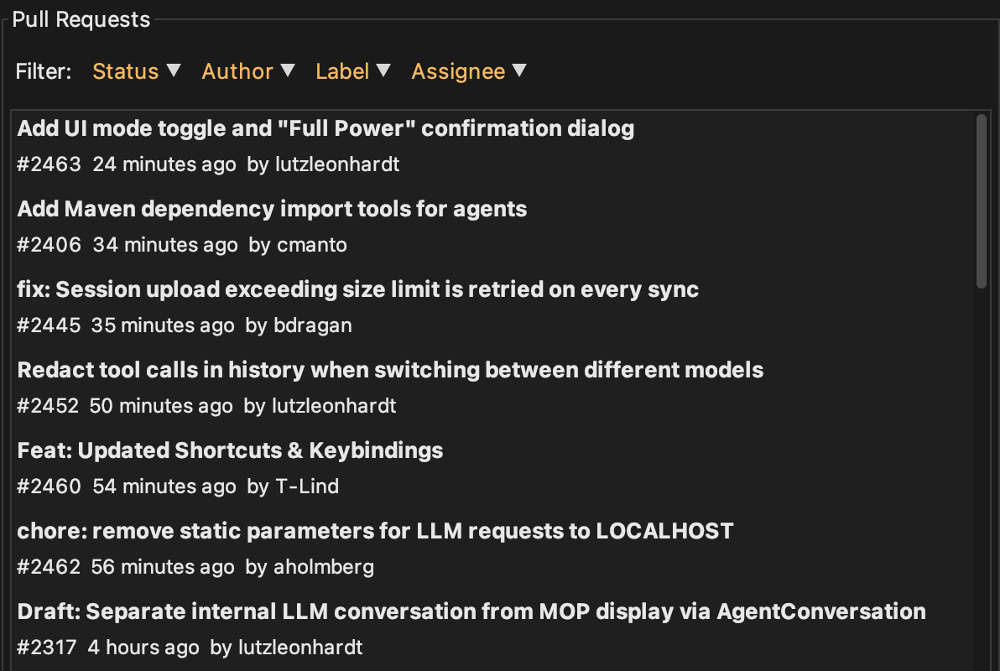

You can search pull requests by **Status**, **Author**, **Label**, or **Assignee**.

Selecting an item from the list will display all commits and changed files on that pull request:

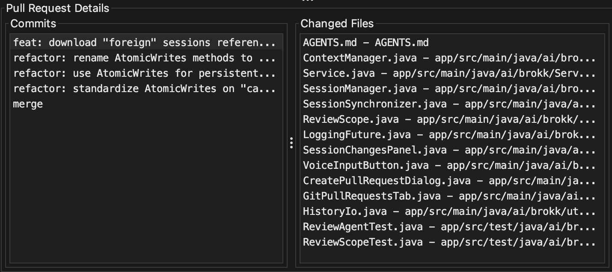

- You can right click a pull request to view the diff, open the PR in your browser, or check out the PR in your workspace.

  - **Note**: Brokk will automatically look for a session when you check out a pull request. This can be used for Guided Review.

- By right clicking on a commit, you can view the diff, compare it against your local branch, or capture the diff to your active context window.

## Creating a Pull Request in Brokk

Brokk lets you raise a GitHub Pull Request (PR) from any branch local or remote without leaving the application. You’ll see the **Create PR** button (+ symbol surrounded by a diamond) in the **Log sidebar** in the commits section:

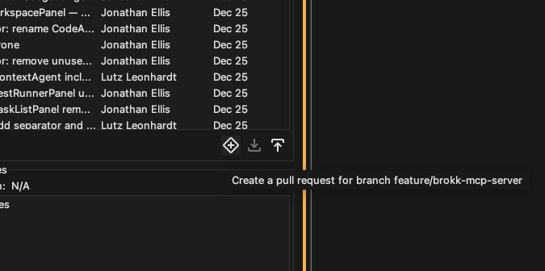

Select your target branch and source branch for the pull request. Brokk will automatically suggest a title and description for your PR.

## Merge Agent

Brokk will automatically detect and offer to resolve Git merge conflicts for you, using **Merge Agent**.

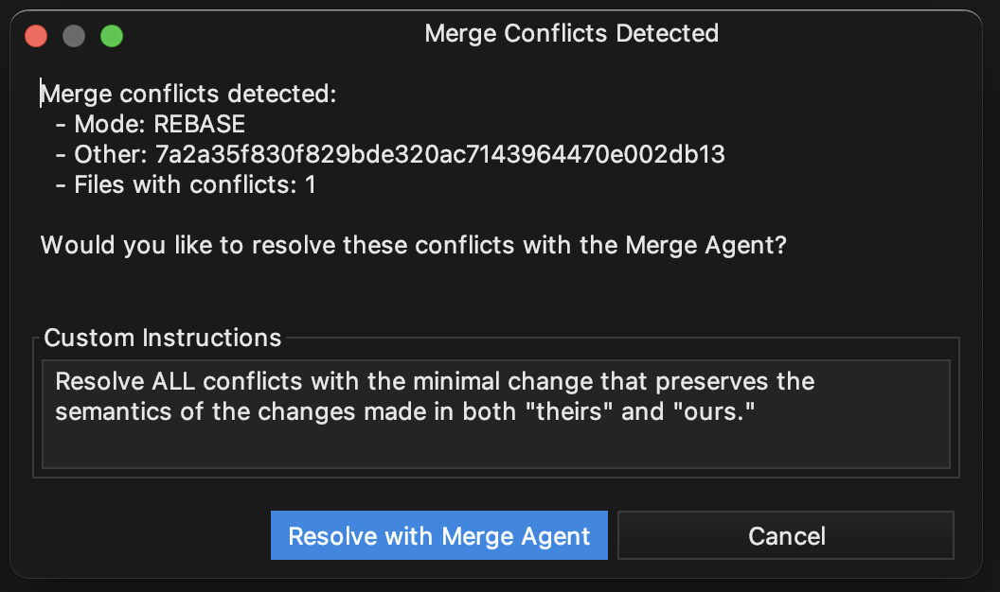

**How it works:** The LLM is given commit history, PR descriptions, and code evolution across both branches to understand what each change was trying to accomplish. It builds semantic graphs (class hierarchies, call graphs, dependencies) to grasp how changes interact, then resolves conflicts based on the actual intent of the code. After resolution, it validates everything - compiling, linting, and running tests to ensure the merge works.

Next: [Issue Tracker Integration](/documentation/issue-tracker-integration)
