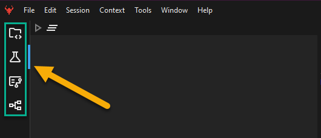
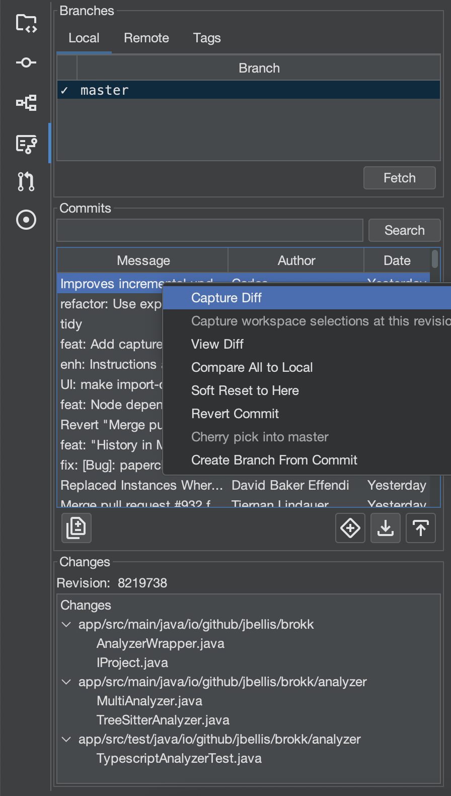
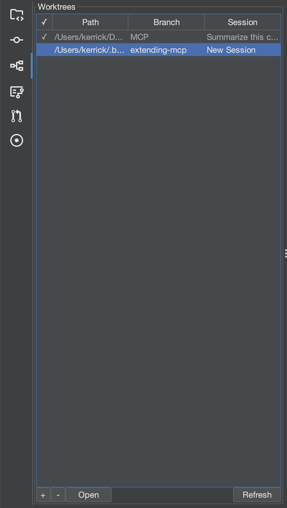
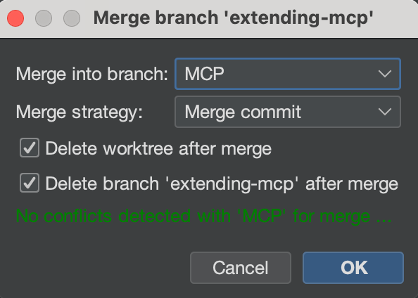
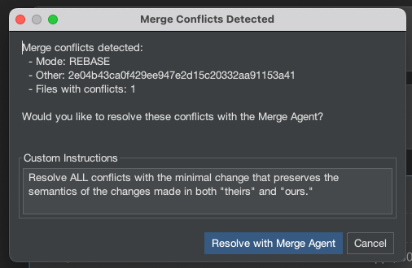
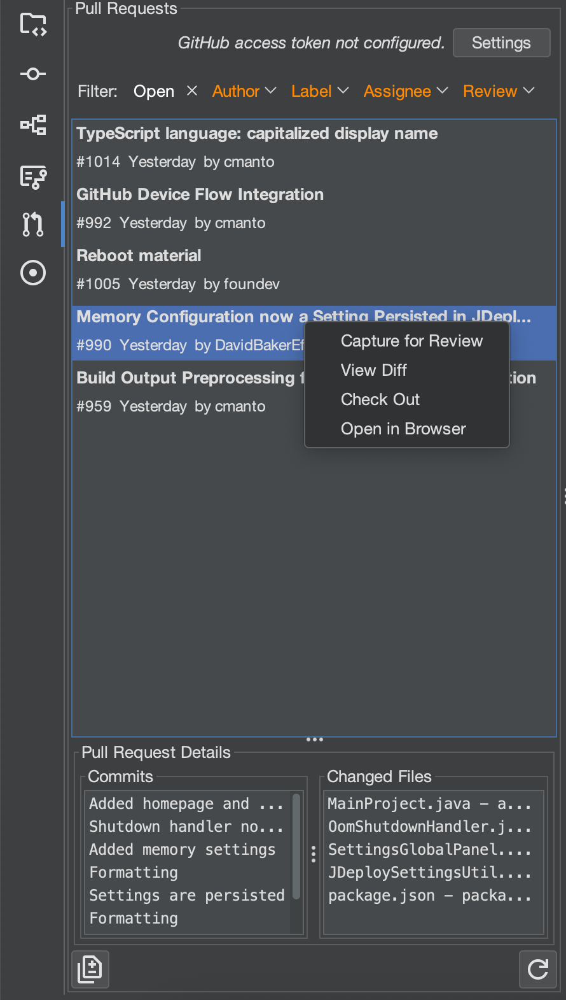
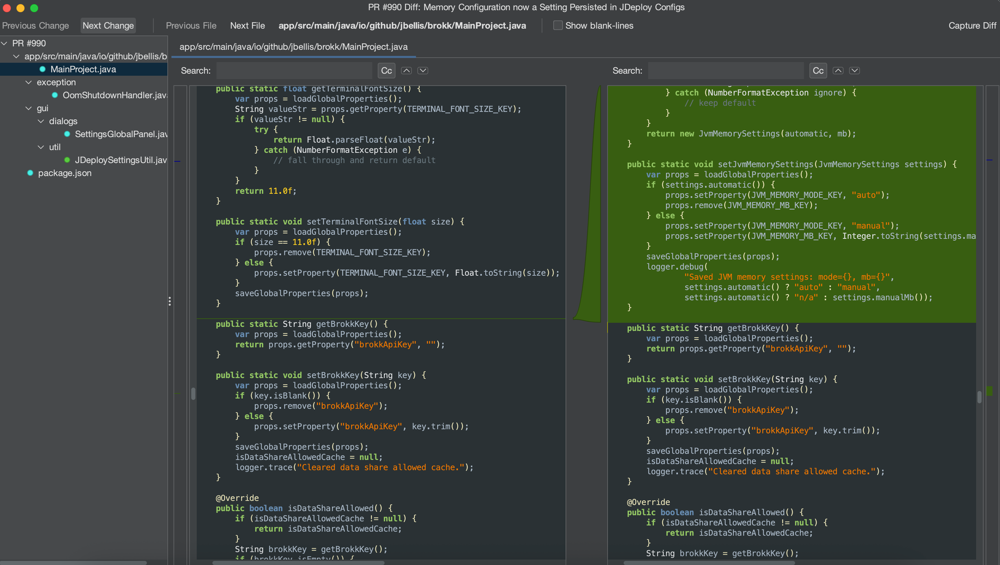
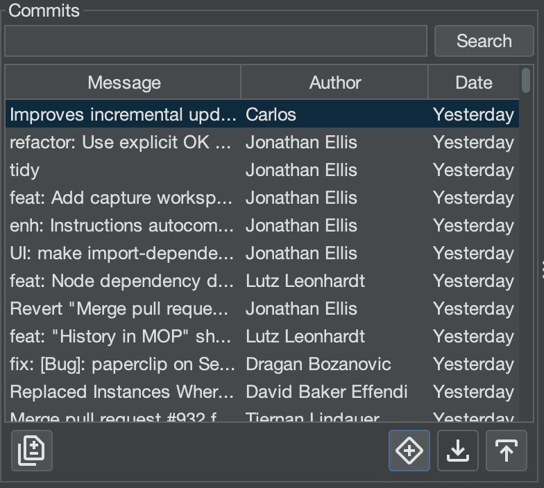
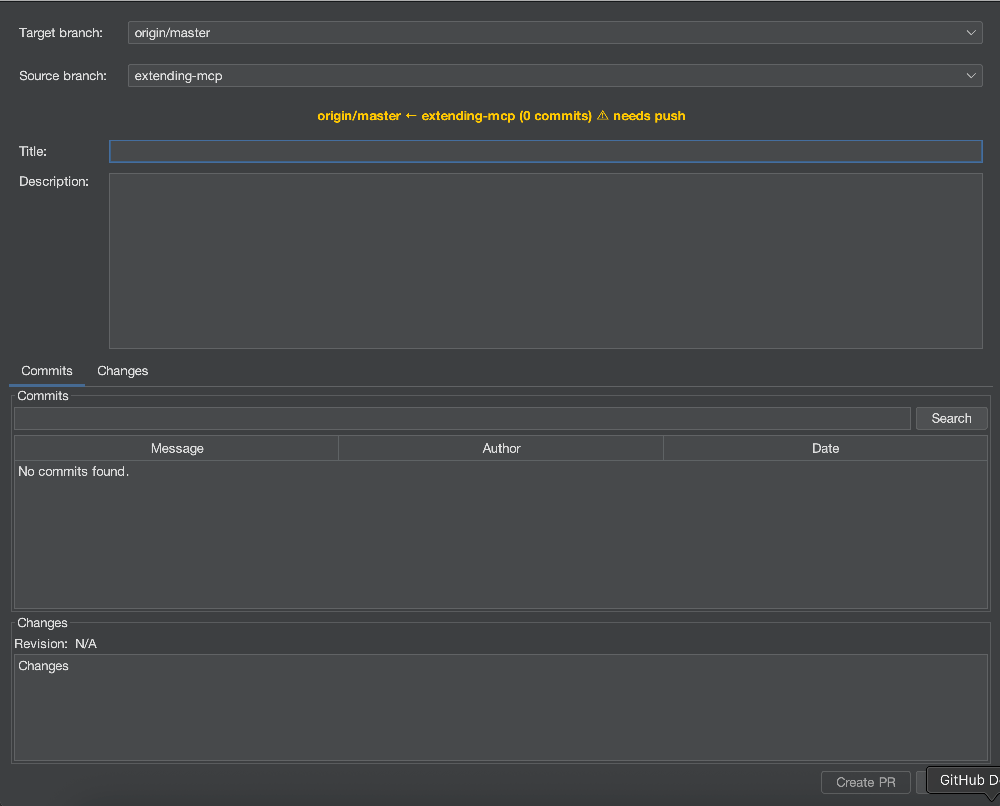
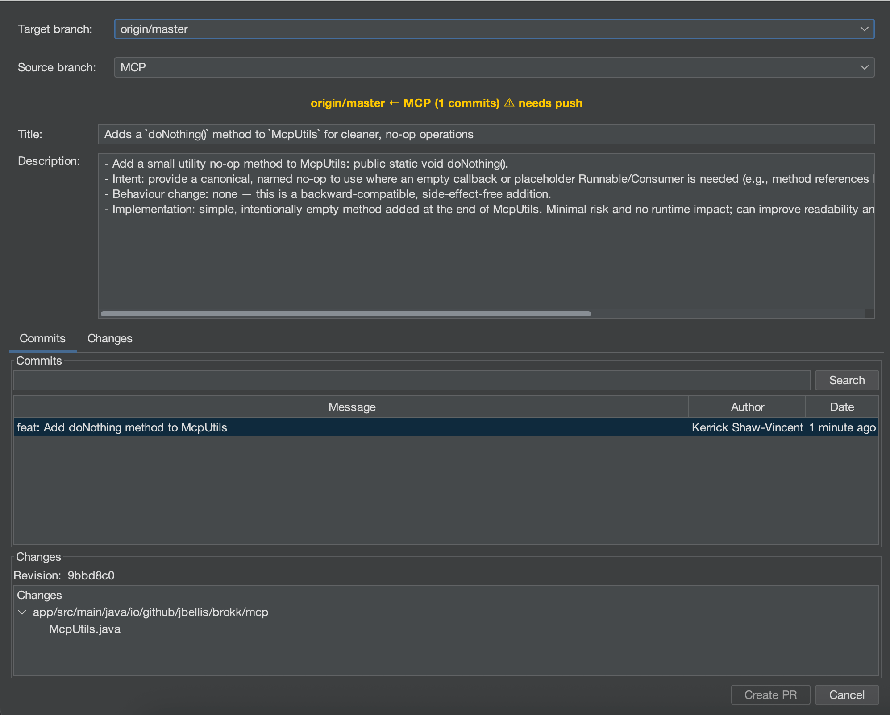

## Git Basics

The Git Panel, located at the left side of the Brokk interface, is your primary interface to bring Git-based historical context into the Workspace. It’s divided into six main tabs: Project Files, Commit, Worktrees, Log, Pull Requests and Issues.  

The rest of the Git Bar is self explanatory so we'll move onto the Log tab first.

## Log

-   **Capture Diff:** This is the most commonly used integration point, useful for asking questions, troubleshooting regressions, and performing merges.
-   **How it works:** Right-click any set of commits or file changes, in the log and select Capture Diff. This adds a unified diff of the selected changes to your Workspace.
-   **Capturing Older Revisions:** Primarily used to give the LLM an anchor point for a particularly complex diff.
-   **How it works:** Double-click a file from a commit’s changes list or from the file’s history. From the preview that opens, select Capture Diff.
-   **Best for:** Understanding the state of code at a specific point in time, or for tasks like backporting a fix.
-   **Compare with Local:** Opens a human-readable diff window from which you can revert changes by chunk.

## Git Worktree Support

Worktrees let you have **multiple check‑outs of the same repository**, allowing for parallel feature work manually or with the Architect.

Add a new worktree with the + button; remove one with -.

Worktrees share the same `.git` object store, which makes them lighter-weight than a full clone. Additionally, Brokk projects are worktree-aware; worktrees will inherit the primary checkout's configuration.

When a worktree window is active, an additional Merge button will appear. Clicking on that will open a dialog like this:

Worktrees are not tied to a single branch; you can check out different branches from the UI in the Log tab, just like with the primary repo. However, each worktree must have a distinct branch open: because of the git index sharing, you cannot have the same branch active in multiple worktrees.

## Merge Agent

Brokk will automatically detect and offer to resolve Git merge conflicts for you, understanding the semantic intent behind code changes on both branches, not just textual differences.

**How it works:** The LLM is given commit history, PR descriptions, and code evolution across both branches to understand what each change was trying to accomplish. It builds semantic graphs (class hierarchies, call graphs, dependencies) to grasp how changes interact, then resolves conflicts based on the actual intent of the code. After resolution, it validates everything—compiling, linting, and running tests to ensure the merge works.

**Best for:** Complex merge conflicts where understanding the purpose of changes matters more than choosing between text blocks. Particularly valuable for long-lived feature branches, refactoring conflicts, or when the same functionality was modified differently on each branch.

## Pull Requests

The **Pull Requests** tab in Brokk shows PRs from your project’s GitHub repository. (If the repo isn’t on GitHub, this tab won’t appear.)

### Key Features

-   **Unified PR List**  
    View all pull requests for the repository in a single, scrollable list.
-   **Filters**  
    Narrow down PRs by **Status**, **Author**, **Label**, **Assignee**, or **Review State**.
-   **PR Details Pane**  
    Selecting a PR displays its **Commits** and **Changed Files** in the panel below.

### Actions on a Selected PR

-   **Check Out**  
    Instantly switch your local workspace to the PR’s branch with a single click.
-   **View Diff**  
    Open a full, graphical side‑by‑side diff viewer for each file changed in the PR.

-   **Capture for Review**  
    Capture the PR diff into your Brokk AI context so the LLM can review or summarize it. (Configurable review instructions are auto‑populated.)
-   **Open in Browser**  
    Launch the PR directly in your web browser.

## Creating a Pull Request in Brokk

Brokk lets you raise a GitHub Pull Request (PR) from any branch local or remote without leaving the application. You’ll see the **Create PR** button (+ symbol surrounded by a diamond) in the **Log** panel in the commits section whenever your project is a Git repository.

### Opening the Create PR Dialog

-   Open the **Log** panel
-   In the **Branches – Local or Remote** list within the commits section, select the branch you want to merge.
-   Click **\+** button.

-   By default, the dialog compares your selected branch against `origin/master`.

### Dialog Layout

**Purpose**  
Brokk’s Create PR dialog gives you everything you need to scope, describe, and review your pull request without context‑switching.

**Header**

-   **Target branch** – the branch you’re merging _into_.
-   **Source branch** – the branch you’re merging _from_ (local or remote).

**Title & Description**

-   Auto‑generated in Markdown by Brokk’s quick‑model.
-   Edit both fields as needed.

**Tabs**

-   **Commits** – lists commits that differ from the target branch.
-   **Changes** – shows a file‑level diff across those commits.

**Footer**

-   **Create PR** / **Cancel** actions.
-   A yellow warning icon appears if local and remote branches are out‑of‑sync.

___

### Branch & Commit Indicators

-   **Blue‑highlighted commits** → local commits not yet pushed
-   **No upstream branch** → the first push automatically creates one
-   **Sync warning** → push or pull to resolve before creating the PR

___

### Typical Workflow

-   Finish work on your feature branch
-   Open **Log**, select the branch, and push if there are blue (unpushed) commits
-   Click **Create PR**
-   (Optional) Change the Target or Source branch—Title and Description will refresh
-   Review the **Commits** and **Changes** tabs
-   Edit Title/Description if required
-   Click **Create PR**—Brokk opens the new PR in your default browser

Next: [Issue Tracker Integration](/documentation/issue-tracker-integration)