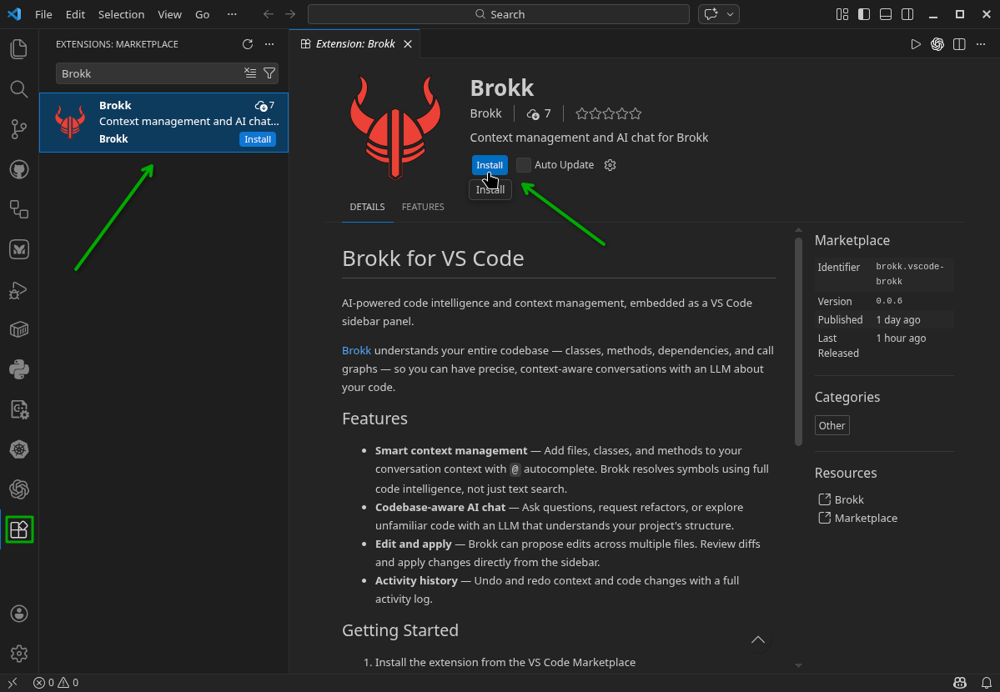
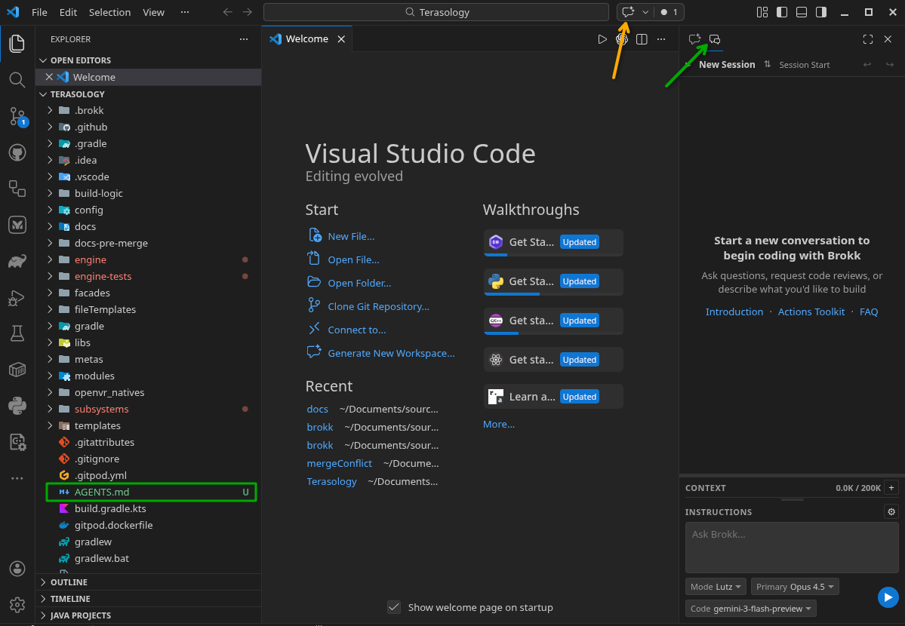
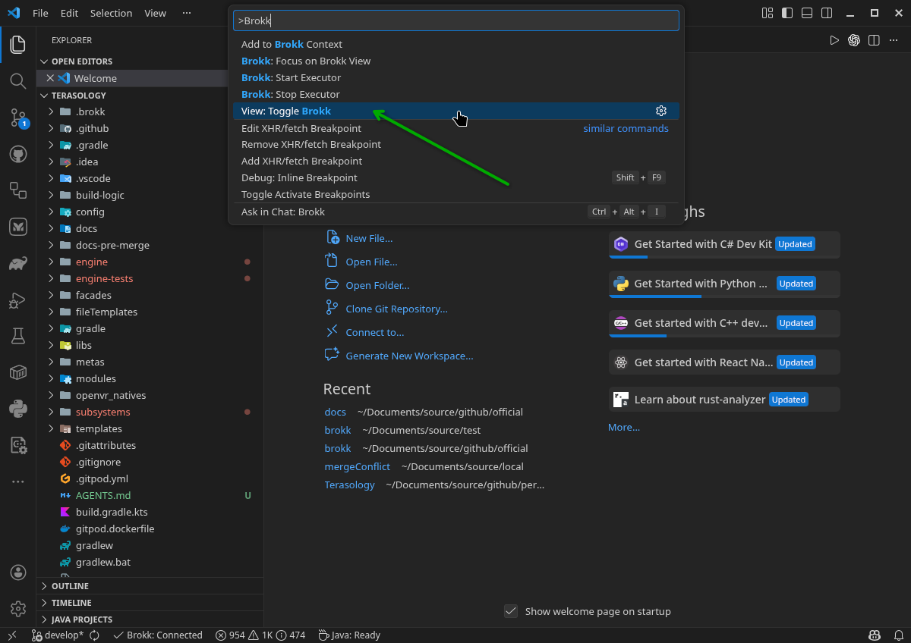
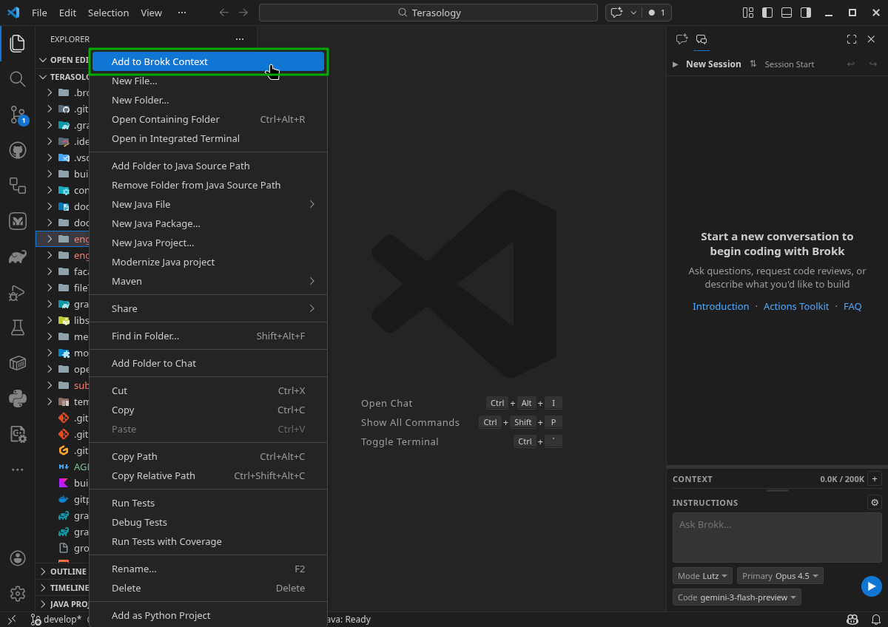
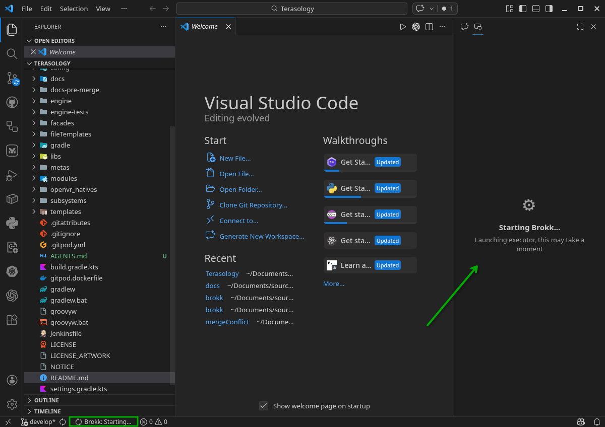

# Getting Started with the Brokk VS Code Extension

The Brokk VS Code extension brings the power of Brokk's semantic code intelligence directly into your editor.

## Installation

You can install the extension in several ways:

- **VS Code Marketplace**: [Download Here](https://marketplace.visualstudio.com/items?itemName=Brokk.vscode-brokk)
- **Within VS Code**:
  1. Open the **Extensions** view (`Ctrl+Shift+X` or `Cmd+Shift+X`).
  2. Search for `Brokk`.
  3. Click **Install**.

## Usage

Once installed, Brokk integrates into your workflow through several components:

### 1. The Brokk Panel
Brokk appears as a tab alongside GitHub Copilot in the side panel or secondary side bar (usually on the right). Click the **Brokk** tab to access the chat interface.

This is where you will:
- Enter your instructions.
- View the **Lutz** research and build process.
- Manage your **Context** badges.

### 2. Using Brokk with VSCodium and Other VS Code Forks
If you are using a version of VS Code that does not include GitHub Copilot (such as VSCodium or certain Linux distributions), the Brokk tab may not be visible. In this case, Brokk can be opened using the **Command Palette**:

1. Open the **Command Palette** (`Ctrl+Shift+P` or `Cmd+Shift+P`).
2. Search for `Brokk: Focus on Chat View`.
3. Press `Enter`.

### 3. Context Menu Integration
You can quickly add files, folders, or specific classes/methods to your context by right-clicking them in the File Explorer or directly in the editor and selecting **Brokk: Add to Context**.

### 4. Hotkeys
- `Ctrl/Cmd + E`: Attach the current file to context.
- `Ctrl/Cmd + Enter`: Submit your instructions to Lutz.

## Initial Setup

When you first open a folder in VS Code with the Brokk extension active, it will begin building its **Code Intelligence** index. You can monitor the progress in the status bar at the bottom right or in the Brokk side panel.

Next: [Code Intelligence](/documentation/code-intelligence)