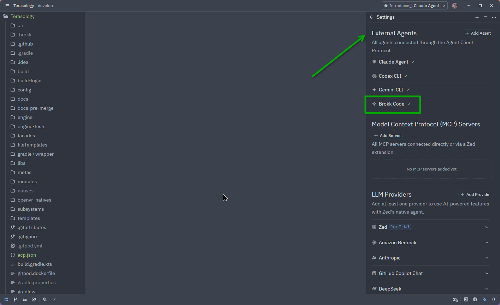

# Zed IDE Integration

Brokk connects to Zed so you can run your Brokk agents directly inside the editor and interact with them in a seamless way. This integration allows you to leverage the power of Brokk's agents while working on your code, providing a more efficient and streamlined workflow.

## Requirements

- Zed installed (latest release).
- Brokk TUI installed and configured with an API key.

## Configure Brokk in Zed

This can be done by Installing Brokk TUI and running the following command in the terminal:

```bash
brokk install zed
```

- Note: if this file already exists you may need to run --force to overwrite the existing file.

Add Brokk in your Zed settings file:

1. Open `Settings: Open Settings (JSON)`

```bash
$HOME/.config/zed/settings.json
```

2. Add (or merge) the following snippet to your settings file, then save. If you already have agent servers configured, just add the `brokk-code` entry.

```json
{
  "agent_servers": {
    "Brokk Code": {
      "favorite_config_option_values": {
        "reasoning": [
          "medium"
        ],
        "mode": [
          "LUTZ"
        ],
        "model": [
          "gpt-5.2"
        ]
      },
      "type": "custom",
      "command": "brokk",
      "args": [
        "acp"
      ],
      "env": {}
    }
  }
}
```

3. Restart Zed after saving the settings so the IDE picks up the new agent access.

## Verify and use

1. Open the AI panel using ctrl+lt+b. `brokk-code`
2. Open the settings option from the top right corner of the AI panel.
3. Validate the Brokk Code shows in the following panel with a green check as seen below.



Next: [Code Intelligence](/documentation/code-intelligence)
